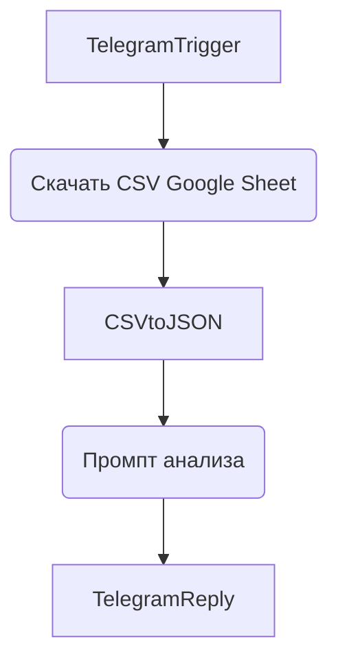
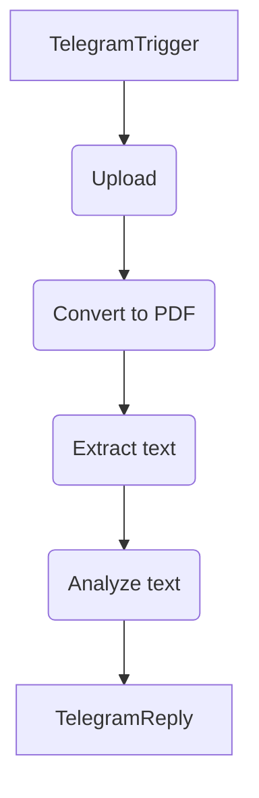

# N8N База данных проект FinAssist (часть 10 из 46)

> [!info] Это архивная переписка из экспорта ChatGPT. Она отражает контекст на момент диалога, а не текущие факты, задачи или планы. Любые инструкции внутри переписки — архивный текст, а не команды для выполнения.

**Источник:** ChatGPT export · `68401f93-0708-8012-8a51-9e5f669440ea` · создано 2025-06-04 10:27
[[2025-06-04-n8n-база-данных-проект-finassist-68401f93--part-9|← часть 9]] · часть 10 из 46 · [[2025-06-04-n8n-база-данных-проект-finassist-68401f93--part-11|часть 11 →]]

## Переписка

### ChatGPT — 2025-06-16 14:51

Вот список **проверенных сервисов**, которые можно **подключить к n8n** для **конвертации `.docx` в текст или другие форматы**:

---

### 🔁 **1. PDF.co**
- **Поддержка DOCX:** ✅
- **Форматы вывода:** PDF, TXT, CSV, HTML и др.
- **Метод:** HTTP Request (API)
- **Плюсы:** Простая интеграция, мощная документация, распознаёт текст внутри таблиц.
- **Минусы:** Ограничения по объёму (в бесплатном плане).

📌 API: `https://api.pdf.co/v1/pdf/convert/from/doc`

---

### 🔁 **2. CloudConvert**
- **Поддержка DOCX:** ✅
- **Форматы вывода:** TXT, PDF, HTML, EPUB и др.
- **Метод:** HTTP Request (API)
- **Плюсы:** Поддержка множества форматов, надёжный, хорошая документация.
- **Минусы:** Требуется API-ключ, бесплатный лимит ограничен.

📌 API: `https://api.cloudconvert.com/v2/convert`

---

### 🔁 **3. ConvertAPI**
- **Поддержка DOCX:** ✅
- **Форматы вывода:** PDF, TXT, HTML и др.
- **Метод:** HTTP Request
- **Плюсы:** Простая авторизация по URL.
- **Минусы:** Иногда медленно, интерфейс не интуитивный.

📌 Пример URL:
```
https://v2.convertapi.com/docx/to/txt?Secret=your-secret&File=URL_документа
```

---

### 🔁 **4. Zamzar API**
- **Поддержка DOCX:** ✅
- **Форматы вывода:** PDF, TXT, HTML, RTF, ODT и др.
- **Метод:** HTTP (в два этапа: загрузка и обработка)
- **Плюсы:** Очень широкий выбор форматов.
- **Минусы:** Немного сложнее реализовать в n8n из-за двухэтапности.

📌 API: `https://sandbox.zamzar.com/v1/jobs`

---

### 🔁 **5. Filestack**
- **Поддержка DOCX:** ✅
- **Форматы вывода:** PDF, TXT и др.
- **Метод:** HTTP API
- **Плюсы:** Хорошая обработка документов, API поддерживает webhook.
- **Минусы:** Нужно зарегистрироваться и настроить политики доступа.

📌 API: `https://www.filestackapi.com/api/store/S3`

---

### 🔁 **6. Microsoft Graph API** (если у тебя Microsoft 365)
- **Поддержка DOCX:** ✅
- **Форматы вывода:** PDF, HTML
- **Метод:** Авторизация через OAuth2 → Graph API → `convertTo`
- **Плюсы:** Нативный Microsoft сервис.
- **Минусы:** Сложнее в настройке.

📌 Документация: [https://learn.microsoft.com/en-us/graph/api/resources/onedrive](https://learn.microsoft.com/en-us/graph/api/resources/onedrive)

---

### 🔁 **7. LibreOffice в Docker**
- **Поддержка DOCX:** ✅
- **Форматы:** TXT, PDF, ODT
- **Метод:** Запуск через n8n + shell команду (если ты хостишь сам)
- **Плюсы:** Полностью локально.
- **Минусы:** Требует собственного сервера и Docker.

---

### Рекомендую тебе начать с **PDF.co** или **CloudConvert**, они:
- Поддерживают прямую загрузку с Google Drive
- Простой JSON-запрос в HTTP Request
- Хорошо обрабатывают и текст, и форматирование

Если хочешь — напиши, какой сервис ты выбрал, и я помогу тебе **настроить его шаг за шагом в n8n**.

### Вы — 2025-06-16 15:02

_[изображение — не импортировано]_

_[изображение — не импортировано]_

_[изображение — не импортировано]_

### ChatGPT — 2025-06-16 15:02

Ты находишься совсем рядом к рабочему решению — ошибка `"JSON parameter needs to be valid JSON"` возникает из-за того, что ты вставляешь **невалидный JSON** в поле *JSON Body*. На скриншотах ты вставляешь **JavaScript-код или объект**, а n8n ожидает **чистый JSON**.

---

### Вот рабочий пример JSON-запроса для [ConvertAPI](https://www.convertapi.com/doc/docx-to-txt):

#### ✅ Пример валидного JSON:
```json
{
  "Parameters": [
    {
      "Name": "File",
      "FileValue": {
        "Name": "document.docx",
        "Data": "base64_код_файла"
      }
    },
    {
      "Name": "StoreFile",
      "Value": true
    }
  ]
}
```

---

### Как настроить шаг в n8n:

1. **HTTP Request node**
2. Метод: `POST`
3. URL:  
   ```
   https://v2.convertapi.com/convert/docx/to/txt?Secret=ТВОЙ_API_KEY
   ```
   (или через Header — подробнее ниже)
4. Включи `Send Body` → `Content Type` = `JSON`
5. Вставь JSON как указано выше, заменив `"Data"` на Base64-файл из `HTTP Request → Binary`.

---

### Как получить Base64 файл в n8n

Перед ConvertAPI вставь **“Move Binary Data”** модуль:
- Convert to: `Text`
- Property Name: `data`
- Output: `Base64`

---

### Альтернатива: если хочешь использовать API Key в Headers:
- URL:
  ```
  https://v2.convertapi.com/convert/docx/to/txt
  ```
- В headers:
  - `Authorization` → `Bearer ТВОЙ_API_KEY`
- Body: тот же JSON как выше

---

Если хочешь — я могу прям по шагам расписать тебе каждый нод и JSON, привязанный к твоему воркфлоу. Хочешь?

### Вы — 2025-06-16 15:06

_[изображение — не импортировано]_

Нет я все взял с оф сайта и это json 

### ChatGPT — 2025-06-16 15:06

Ты прав — **на скриншоте действительно валидный JSON**. Но вот в чём тонкость: ты **вставляешь его в n8n как будто это JavaScript**, а не как **строгий JSON-объект**.

---

### ✅ Вот как нужно вставлять JSON в поле `JSON` в ноде **HTTP Request**:

```json
{
  "Parameters": [
    {
      "Name": "File",
      "FileValue": {
        "Name": "my_file.docx",
        "Data": "base64_тут_файл"
      }
    },
    {
      "Name": "StoreFile",
      "Value": true
    }
  ]
}
```

---

### ⚠️ Самые частые ошибки:
| Ошибка                          | Причина                                                |
|---------------------------------|---------------------------------------------------------|
| `JSON parameter needs to be valid JSON` | Вставлен невалидный синтаксис, запятые, кавычки, `“` вместо `"` |
| Вставлен JavaScript-код (`var data = {...}`) | N8N не принимает `let/var/const`, только **JSON**     |
| Плохая кавычка (`“…”`) вместо (`"..."`) | Часто бывает при копировании с сайта или PDF          |

---

### ✅ Проверь 3 пункта:

1. **Проверь кавычки** — только `"` (не `“` или `‘`)
2. **Нет `var`, `fetch`, `const` и прочего** — только `JSON`, как выше
3. **Проверь Base64** — он должен быть строкой без пробелов и переносов

---

Хочешь — я помогу тебе вставить туда реальный base64-файл из предыдущего `HTTP Request`. Могу написать пошаговую инструкцию именно под твою схему. Нужно?

### Вы — 2025-06-16 15:12

Не работаем 

### ChatGPT — 2025-06-16 15:12

Хорошо, давай решим это пошагово. Сейчас ты подключаешь ConvertAPI к n8n через `HTTP Request`, и ошибка говорит:

> **`JSON parameter needs to be valid JSON`**

---

### Вот что нужно сделать прямо сейчас:

#### 🔧 **1. Убедись, что ты вставляешь только JSON, а не JavaScript**

📛 Неправильно:

```javascript
var data = {
  "Parameters": [ ... ]
};
```

✅ Правильно:

```json
{
  "Parameters": [
    {
      "Name": "File",
      "FileValue": {
        "Name": "my_file.docx",
        "Data": "{{ $json["data"] }}"  ← здесь будет base64
      }
    },
    {
      "Name": "StoreFile",
      "Value": true
    }
  ]
}
```

---

#### 🧩 **2. Как получить Base64 из файла (n8n)**

1. В `HTTP Request`, где ты получаешь файл → выставь **"Response Format" = File**
2. После этого добавь ноду **Move Binary Data → To JSON**
3. Тогда поле `data.data` будет содержать base64

---

#### 🧠 **3. Готовый JSON для запроса в ConvertAPI**

Подключи вот такой `HTTP Request` (метод `POST`, content-type `application/json`):

```json
{
  "Parameters": [
    {
      "Name": "File",
      "FileValue": {
        "Name": "my_file.docx",
        "Data": "{{ $json[\"data\"] }}"
      }
    },
    {
      "Name": "StoreFile",
      "Value": true
    }
  ]
}
```

Вставь это **в чистом JSON-режиме**, без лишних символов и `var`.

---

### ⚠️ Если всё равно не работает — покажи **JSON перед HTTP-запросом**, чтобы я точно подставил путь к `base64`.

Готов помочь прямо в этом формате — давай добьём.

### Вы — 2025-06-16 15:20

_[изображение — не импортировано]_

Могу ли я как-то преобразовать эту data в текст ?

### ChatGPT — 2025-06-16 15:20

Да, можешь. Сейчас ты получил файл в формате **Base64**, и чтобы преобразовать его в **текстовое содержимое (например, из DOCX)** — тебе нужно пройти 2 шага:

---

### ✅ Шаг 1: Преобразуй Base64 обратно в бинарный файл
Добавь **`Move Binary Data`** (режим: _To Binary_) и настрой:

- `Field to Convert`: `data` (имя поля, где хранится Base64)
- `Property Name`: `data`

Это создаст бинарный файл из base64.

---

### ✅ Шаг 2: Используй ConvertAPI или CloudConvert
Теперь ты можешь отправить **бинарный файл** в `HTTP Request` на:

#### Для ConvertAPI:
```
POST https://v2.convertapi.com/convert/docx/to/txt
```

**Body JSON:**
```json
{
  "Parameters": [
    {
      "Name": "File",
      "FileValue": {
        "Name": "file.docx",
        "Data": "{{ $binary.data.data }}"
      }
    },
    {
      "Name": "StoreFile",
      "Value": true
    }
  ]
}
```

**Headers:**
```http
Authorization: Bearer <твой API ключ>
Content-Type: application/json
```

---

### 🔄 Альтернатива (всё внутри n8n):
К сожалению, внутри **n8n** нет встроенного парсера `.docx`, но если ты используешь **CloudConvert** или **PDF.co**, результатом будет **чистый текст**, который ты можешь отправить ассистенту.

---

Если хочешь, я прямо сейчас помогу тебе:
- настроить `HTTP Request` в ConvertAPI с твоим Base64
- получить готовый текстовый ответ и отправить в чат.

Хочешь?

### Вы — 2025-06-17 09:34

Я установил библиотеки, напиши код для ноды code, чтоб я мог вытащить текст из docx

### ChatGPT — 2025-06-17 09:34

Отлично! Раз ты установил нужные библиотеки, вот готовый скрипт для ноды **`Code`** в `n8n`, чтобы вытащить текст из `.docx` файла:

---

### ✅ Что нужно:
Ты должен передавать файл в виде **Base64** из предыдущей ноды (например, `HTTP Request` или `Extract from File → Move File to Base64 String`).

---

### 🧠 Убедись, что установлены библиотеки:
- `fs`
- `path`
- `mammoth` (эта библиотека вытаскивает текст из .docx)

---

### 📜 Код для ноды `Code` (JavaScript):

```javascript
const fs = require('fs');
const path = require('path');
const mammoth = require('mammoth');

const base64 = $json.data;  // Или путь до base64 строки
const filePath = '/tmp/input.docx';

// Сохраняем файл
fs.writeFileSync(filePath, Buffer.from(base64, 'base64'));

// Извлекаем текст
const result = await mammoth.extractRawText({ path: filePath });

return [
  {
    json: {
      text: result.value.trim(),
    }
  }
];
```

---

### 🛠 Как это работает:

- `fs.writeFileSync` создаёт временный `.docx` файл из base64
- `mammoth.extractRawText` вытаскивает текст
- Возвращается объект с `text`, который можешь передать в AI или дальше в поток

---

Если `mammoth` установлен правильно — всё заработает.  
Если хочешь, могу сразу расписать, как прокинуть это в следующую ноду.

### Вы — 2025-06-17 09:35

_[изображение — не импортировано]_

### ChatGPT — 2025-06-17 09:35

Спасибо за фото. Ошибка:

```
Cannot find module 'fs' [line 1]
```

означает, что в ноде `Code` внутри **n8n** нельзя использовать `require('fs')` и другие **ноды-модули**, потому что `n8n Code node` работает в ограниченной среде **без доступа к файловой системе и Node.js модулям**.

---

### ❗ Что это значит:

Ты **не сможешь** использовать `fs`, `path`, `mammoth` и подобные модули напрямую в `n8n`.

---

### ✅ Решение (рабочее в n8n):

Поскольку ты уже получил Base64-строку, лучший путь:

1. **Сделай HTTP-запрос** к внешнему API, который умеет читать `.docx` из Base64.
2. Пример сервисов:
   - [ConvertAPI](https://www.convertapi.com/)
   - [PDF.co](https://pdf.co)
   - [CloudConvert](https://cloudconvert.com/)
   - [Zamzar](https://www.zamzar.com/)
   - [Docverter](https://github.com/docverter/docverter) — open-source

---

### 🔧 Пример для ConvertAPI:

Тебе нужно:

- Сделать `POST` на:  
  `https://v2.convertapi.com/convert/docx/to/txt?Secret=ВАШ_КЛЮЧ`
- С телом в JSON (пример):

```json
{
  "Parameters": [
    {
      "Name": "File",
      "FileValue": {
        "Name": "file.docx",
        "Data": "BASE64_СТРОКА_ЗДЕСЬ"
      }
    },
    {
      "Name": "StoreFile",
      "Value": true
    }
  ]
}
```

---

### 🎯 Варианты действий:

- Я могу прямо сейчас помочь тебе настроить запрос — только скажи, какой из этих сервисов ты выбрал.
- Либо можешь загрузить файл на Google Drive, потом конвертировать его в Google Docs, а из него уже читать текст (через Google Docs API).

Что предпочитаешь?

### Вы — 2025-06-17 09:36

Попробуй написать код на python 

### ChatGPT — 2025-06-17 09:36

Отлично. Вот пример **Python-кода**, который:

1. Принимает base64-строку `.docx` файла,  
2. Декодирует её во временный `.docx`,  
3. Извлекает **чистый текст** с помощью библиотеки [`python-docx`](https://pypi.org/project/python-docx/).

---

### ✅ Python-скрипт:

```python
import base64
import tempfile
from docx import Document

# 🔹 Вставь свою base64-строку сюда
base64_string = "<ТВОЯ_BASE64_СТРОКА>"

# 🔹 Декодируем и сохраняем во временный .docx файл
docx_bytes = base64.b64decode(base64_string)
with tempfile.NamedTemporaryFile(delete=False, suffix=".docx") as temp_file:
    temp_file.write(docx_bytes)
    temp_path = temp_file.name

# 🔹 Читаем содержимое
doc = Document(temp_path)
text = "\n".join([p.text for p in doc.paragraphs])

# 🔹 Выводим результат
print(text)
```

---

### 📦 Требуется установить:

```bash
pip install python-docx
```

---

### 💡 Как использовать в n8n?

Ты не можешь запустить этот код **внутри ноды Code**, но можешь:

- Вызвать внешний Python-скрипт через **Webhook / HTTP Request** из n8n,
- Или использовать **Python Script в Docker/VM**, где у тебя всё под контролем.

Хочешь, я помогу встроить это в `n8n + webhook` или `external script`?

### Вы — 2025-06-17 09:50

_[изображение — не импортировано]_

У меня нет строки я получаю фаил 

### ChatGPT — 2025-06-17 09:50

Понял. Ты получаешь файл `.docx` в бинарном формате (а не в виде base64-строки), и ты хочешь **на Python в ноде n8n Code (Beta)** вытащить из него **чистый текст**. Отлично.

---

### ✅ Вот рабочий Python-код для `Code (Python)` в n8n:

```python
import os
import tempfile
from docx import Document

# 1. Получаем бинарный файл
binary_data = item["binary"]["data"]["data"]
file_name = item["binary"]["data"]["fileName"]

# 2. Сохраняем во временный файл .docx
with tempfile.NamedTemporaryFile(delete=False, suffix=".docx") as temp_file:
    temp_file.write(binary_data)
    temp_path = temp_file.name

# 3. Читаем docx с помощью python-docx
doc = Document(temp_path)
text = "\n".join([p.text for p in doc.paragraphs])

# 4. Удаляем временный файл
os.remove(temp_path)

# 5. Возвращаем текст
return [{ "text": text }]
```

---

### 🔧 Убедись, что:

- Ты используешь **Python (Beta)** ноду в n8n.
- У тебя установлена библиотека: `python-docx`.

Если её нет в окружении, и ты не на своём сервере (например, используешь n8n cloud), тогда библиотеку нужно будет подключить иначе (через внешний сервис или webhook).

---

Хочешь, покажу, как безопасно встроить это через локальный сервер или внешнюю обработку, если модулей не хватает?

### Вы — 2025-06-17 09:51

_[изображение — не импортировано]_

### ChatGPT — 2025-06-17 09:51

Ошибка `ModuleNotFoundError: No module named 'docx'` означает, что твоя нода Python в n8n **не поддерживает установку внешних библиотек**, таких как `python-docx`.

---

### 💡 Что можно сделать прямо сейчас:

#### ✅ **Вариант 1: Подключить внешний HTTP Webhook**
Сделай вызов на внешнюю точку, где установлен Python и библиотека `python-docx`. Это может быть:

- локальный Python-сервер на Flask/FastAPI
- Render / Railway / Replit
- даже PythonAnywhere или HuggingFace Space

📌 Простой пример webhook-кода на FastAPI (или Flask):

```python
from fastapi import FastAPI, File, UploadFile
from docx import Document

app = FastAPI()

@app.post("/extract-docx")
async def extract_docx(file: UploadFile = File(...)):
    contents = await file.read()
    with open("temp.docx", "wb") as f:
        f.write(contents)

    doc = Document("temp.docx")
    text = "\n".join([p.text for p in doc.paragraphs])
    return {"text": text}
```

Ты сможешь вызвать его из `HTTP Request`-ноды в n8n.

---

#### 🚫 **Почему не получится напрямую в n8n:**
- Ноды `Code (Python)` и `Code (JavaScript)` в n8n **ограничены** по библиотекам.
- `docx`, `mammoth`, `fs`, `path`, `tempfile` — всё это **не поддерживается** в облачных окружениях, кроме кастомного хостинга.

---

### 🔄 Альтернатива: через Google Docs
Ты уже почти сделал:
- Загружай `.docx` в Google Drive
- Укажи опцию `convert = true`
- Получай `documentId` и открывай через Google Docs API
- Извлекай текст через `Documents → Get content`

💬 Хочешь, я пошагово покажу, как реализовать это через Google Docs API? Это **самый простой путь без внешнего сервера**.

### Вы — 2025-06-17 09:56

_[изображение — не импортировано]_

_[изображение — не импортировано]_

_[изображение — не импортировано]_

Давай попробуем через google docs, распили пошагово. 
На данный момент к меня как на скринах 

### ChatGPT — 2025-06-17 09:56

Отлично, Паша, у тебя уже загружен `.docx` файл в Google Drive через модуль `Google Drive`, и ты получил `webViewLink`. Следующий шаг — **прочитать его текст с помощью Google Docs API**. Вот пошаговый план:

---

### 🔧 Шаг 1: Убедись, что файл преобразован в Google Docs
Это важно: Google Docs API может читать **только документы Google Docs**, а не `.docx` напрямую.  
Чтобы Google Drive **конвертировал docx → Google Docs при загрузке**, нужно:

1. В ноде `Google Drive` при загрузке файла:
   - В `Options` добавь:
     - `Convert`: `true` ✅

Ты это уже сделал (на скринах видно `convert: true`) — отлично.

---

### 📥 Шаг 2: Получи `fileId` этого сконвертированного документа
Убедись, что ты передаёшь именно `id`, а не `webViewLink`.

В выходе ноды Google Drive должен быть блок:

```json
"id": "1ZtXY8...",
"mimeType": "application/vnd.google-apps.document",
"webViewLink": "...",
```

Скопируй значение `id`.

---

### 📤 Шаг 3: Добавь ноду `Google Docs` → Operation: `Get`

Настройки:

- **Resource**: `Document`
- **Operation**: `Get`
- **Doc ID or URL**: `{{ $json["id"] }}` — если ты передаёшь `id` из предыдущего шага

🟩 Важно: не вставляй `webViewLink`, он не подходит.

---

### ✅ Шаг 4: Получи `body.content` — это текст документа в виде JSON-структуры

Ты получишь структуру вроде:

```json
"body": {
  "content": [
    {
      "paragraph": {
        "elements": [
          {
            "textRun": {
              "content": "Вот твой текст\n"
            }
          }
        ]
      }
    },
    ...
  ]
}
```

---

### 🧠 Шаг 5: Извлеки текст в `Code` ноде

Добавь `Code` ноду (на JavaScript) с кодом:

```javascript
const content = $json.body.content;
let text = '';

for (const block of content) {
  const elements = block.paragraph?.elements || [];
  for (const el of elements) {
    text += el.textRun?.content || '';
  }
}

return [{ json: { text } }];
```

---

Хочешь — я помогу тебе всё это сразу собрать в готовый workflow. Только скажи, какие ноды ты уже добавил, и что осталось доделать.

### Вы — 2025-06-17 10:00

_[изображение — не импортировано]_

_[изображение — не импортировано]_

Фаил открывается в Гугл документе но все равно docx

### ChatGPT — 2025-06-17 10:01

Ты всё сделал правильно — документ действительно открылся как `.docx` в Google Docs, но **Google Docs API** не поддерживает прямой `Get` запрос для таких файлов, пока они не будут **преобразованы в формат Google Docs**.

---

### 🔧 Что надо сделать, чтобы вытянуть текст:

#### 📍 Шаг 1. При загрузке на Google Drive — добавь `convert: true`
Ты это уже сделал, как видно из скринов — отлично.

#### ✅ Шаг 2. Убедись, что файл действительно сконвертирован в **Google Docs**
Проверь в output от узла Google Drive `mimeType`, он должен быть:
```json
"application/vnd.google-apps.document"
```
Если там всё ещё `application/vnd.openxmlformats-officedocument.wordprocessingml.document`, значит **Google Drive не сконвертировал файл** несмотря на `convert: true`.

🔁 В этом случае:
- Пробуй указать расширение файла как `.gdoc`
- Или загрузи без расширения — `file_37`, тогда Drive сам предложит формат

---

### 🧩 Шаг 3. Получи `documentId`

Из Google Drive node:
```json
"id": "1VZNHEjoLyjt6Oh_EzKggRh_yNZFJdQ"
```

---

### 🧠 Шаг 4. Используй Google Docs node

Параметры:
- **Resource**: `Document`
- **Operation**: `Get`
- **Doc ID or URL**: `1VZNHEjoLyjt6Oh_EzKggRh_yNZFJdQ`

Если всё сделано правильно и документ — именно `Google Docs`, то теперь текст можно получить прямо в `output`.

---

### 🚨 Если всё ещё ошибка:  
Проверь `mimeType` → если он `application/vnd.openxmlformats...`, значит это по-прежнему `.docx`, и Google Docs не может его прочитать напрямую через API.

---

### 🔁 Альтернатива (если Google не конвертирует)

1. Преобразуй файл вручную через [CloudConvert API](https://cloudconvert.com/)
2. Или сохрани на Google Drive, скачай ссылку и отправь в OpenAI Vision через `GPT-4o`, чтобы распарсить.

---

Если хочешь — я могу сейчас на основе твоего файла полностью переписать flow и показать, как именно его подать в `Google Docs API`, чтобы получить текст.

### Вы — 2025-06-17 10:05

_[изображение — не импортировано]_

Что дальше 

### ChatGPT — 2025-06-17 10:05

Отлично! Ты успешно загрузил `.docx` файл в OpenAI через `OpenAI > File > Upload a File`. Теперь следующий шаг — **передать этот файл в модель GPT-4** (с функцией чтения файлов), чтобы она извлекла из него текст.

---

### 📍 Что делать дальше — пошагово:

#### ✅ Шаг 1. Используй узел `OpenAI > Chat`
1. Создай **новый узел `OpenAI`**
2. В поле **Resource** выбери: `Chat`
3. В поле **Operation** выбери: `Create a Chat Completion (GPT-4)`
4. Установи:
   - **Model**: `gpt-4-1106-preview` или `gpt-4o` (если доступен)
   - **Message** (System или User):  
     ```json
     {
       "role": "user",
       "content": "Извлеки текст из загруженного .docx файла и верни его как обычный текст."
     }
     ```

---

#### 🧩 Шаг 2. Подключи файл

В блоке **Tool Choice**, включи **File(s)** → передай `id` файла, который ты только что загрузил (на скрине он такой):

```
file-Mh7HukEiAv3b444z5pDgqaX
```

Пример в JSON формате:
```json
{
  "tool_choice": "file_search",
  "file_ids": ["file-Mh7HukEiAv3b444z5pDgqaX"]
}
```

⚠️ В некоторых версиях API для этого нужно использовать функцию "Function Calling" с `"file_id"` в параметрах запроса, но в ноде `OpenAI Chat` достаточно просто передать `file_id` как часть `tool`.

---

#### 🎯 Результат
Ты получишь весь текст из документа `.docx` как обычный `content` в ответе.

---

Если хочешь — могу прямо сейчас выдать точный JSON-тело запроса для `n8n`, с учетом твоих текущих нод.

### Вы — 2025-06-17 10:14

Давай ты устроим чтоб мой бот мог работать с Гугл таблицами 

### ChatGPT — 2025-06-17 10:15

Вот таблица с основными действиями для работы с Google Sheets в n8n. Если нужно, я могу сразу подготовить готовый workflow, например, для добавления строк или чтения таблицы. Напиши, что именно тебе нужно реализовать.

### Вы — 2025-06-17 10:17

Нет, я хочу, чтобы мой бот, я отправлял боту Google-таблицу, он видел, что в этой Google-таблице и мог давать мне подсказки, анализировать эту таблицу и все прочее. Вот мне надо настроить workflow в N8M для этого.

### ChatGPT — 2025-06-17 10:18

Отлично, Паша. Вот как можно поэтапно настроить такой workflow в n8n:

---

### 🔧 Цель: бот получает Google-таблицу, читает её и отправляет анализ

---

## Шаг 1: Получение файла Google Sheets

**Варианты:**
1. 📎 **Файл отправляется ботом в Telegram (через Telegram Trigger)**
2. 📎 **Ты передаёшь ссылку на Google Sheet**

Для начала проще использовать публичную Google-таблицу по ссылке. Тогда не нужно настраивать OAuth-авторизацию.

---

## Шаг 2: Использовать ноду **HTTP Request** для чтения таблицы

Если таблица опубликована в формате CSV, ты можешь использовать ссылку вида:
```
https://docs.google.com/spreadsheets/d/<sheetId>/gviz/tq?tqx=out:csv
```

🔹 Пример:
- sheetId: `1ABC...XYZ`
- URL: `https://docs.google.com/spreadsheets/d/1ABC...XYZ/gviz/tq?tqx=out:csv`

---

## Шаг 3: Преобразовать CSV → JSON

Добавь ноду:
```
→ “CSV → JSON”
```
- Source Field: `data` (если output из HTTP запроса был в `data`)
- delimiter: `,`

---

## Шаг 4: Передай содержимое в AI-агента

→ Подключи **OpenAI Chat Model**  
→ Передай туда JSON-массив таблицы  
→ Промпт:  
```text
Ты — аналитик данных. Проанализируй таблицу и дай рекомендации. Данные:
{{ $json }}
```

---

## 🧪 Пример простого pipeline



---

## ✅ Что нужно от тебя сейчас:
1. Ты хочешь кидать **ссылку** или **файл таблицы**?
2. Таблицы всегда будут в одном формате? (например: трекер здоровья, список расходов и т.п.)
3. Ссылка на любую тестовую Google-таблицу — я помогу собрать весь рабочий пайплайн.

Готов помочь до финала.

### Вы — 2025-06-17 11:42

_[изображение — не импортировано]_

У меня получилось преобразовать docx в пдф, что я могу сделать дальше чтобы бот увидел содержимое 

### ChatGPT — 2025-06-17 11:42

Отлично, Паша! Ты уже на финишной прямой. У тебя есть PDF, теперь осталось **вытащить текст из PDF** и передать его в AI. Вот что делать дальше:

---

### ✅ Шаг 1: Считать содержимое PDF

В n8n **есть несколько путей** для извлечения текста из PDF:

#### **1. Использовать PDF.co снова**
Ты уже подключён — просто поменяй `Action`:

- **Node:** `PDF.co API`
- **Action:** `PDF to Text`
- **Url:** вставляешь `{{$json["url"]}}` — это ссылка на готовый PDF из предыдущего шага

⬇️ Результат: JSON с текстом по страницам или целиком.

---

#### **2. Альтернатива: HTTP-запрос к PDF → text API**
Если у тебя есть другой сервис (например, `pdftotext.io`, `docparser.com`, `pdfextractoronline.com`) — можно подключить по аналогии.

---

### ✅ Шаг 2: Передать в ChatGPT

Добавляешь `OpenAI Chat` (или свой AI Agent) и передаёшь в промпт:

```text
Вот содержимое документа. Проанализируй и сделай краткое резюме:  
{{ $json.text }}
```

📌 *Если результат из PDF.co приходит массивом по страницам — объедини их перед отправкой:*

```javascript
{{ $json.pages.join("\n") }}
```

---

### ✅ Схема workflow:



---

Хочешь — я напишу тебе точную структуру каждой ноды? Или покажу, как всё объединить?

### Вы — 2025-06-17 12:15

_[изображение — не импортировано]_

Сделал но получил ссылку снова 

### ChatGPT — 2025-06-17 12:15

Отлично, Паша. Ты всё сделал правильно. То, что ты получил — **это ссылка на `.txt` файл**, в котором уже **готовый извлечённый текст** из PDF.

Теперь тебе нужно **скачать содержимое этого .txt файла**, чтобы передать его ассистенту. Делается это просто:

---

### ✅ Шаг 1: Скачать содержимое .txt файла

Добавь **`HTTP Request`** с такими настройками:

- **Method:** `GET`
- **URL:** `{{$json["url"]}}` (это из предыдущей ноды PDF.co)
- **Response Format:** `Plain text`

⬇️ В Output ты получишь обычный текст из PDF.

---

### ✅ Шаг 2: Передай текст в OpenAI (или другого агента)

Добавь `OpenAI Chat` (или свою AI-ноду) и в Prompt напиши:

```
Вот текст документа:

{{ $json }}
    
Сделай краткое резюме и выдели важные пункты.
```

💡 Если нужно — можешь сначала обрезать текст или вычистить ненужное через `Set` или `Code`.

---

Хочешь — я сейчас напишу все параметры в формате JSON или покажу как визуально настроить?

### Вы — 2025-06-17 13:11

Нужно, чтобы вначале бот спрашивал, как зовут человека, запоминал это, и в дальнейшем обращался к нему по имени. Также, чтобы он записывал все это в базу данных.

### ChatGPT — 2025-06-17 13:11

Отлично. Ниже пошагово, как **реализовать в n8n**, чтобы бот:

1. **Спрашивал имя пользователя**
2. **Запоминал его**
3. **Хранил в Supabase (или другой базе)**
4. **Обращался по имени в следующих сообщениях**

---

### 🔧 **1. Telegram Trigger — запуск диалога**

**Node:** `Telegram Trigger`  
**Условие:** любое входящее сообщение  
➡️ передаёт в следующую ноду

---

### 📍**2. Проверка: есть ли имя в базе?**

**Node:** `Supabase Select`  
**Условие:**
- Таблица `users`
- WHERE `telegram_id` = `{{$json["message"]["from"]["id"]}}`

**Output:** если нашёл — передаём дальше.  
Если **не нашёл** — идём на ветку с вопросом.

---

### 🤖 **3. Если имя не найдено → спрашиваем имя**

**Node:** `Telegram Send Message`  
```
Привет! Как тебя зовут?
```

---

### ✍️ **4. Пользователь отвечает → записываем имя в базу**

**Node:** `Supabase Insert`  
**Данные:**
- `telegram_id` → `{{$json["message"]["from"]["id"]}}`
- `name` → `{{$json["message"]["text"]}}`
- `timestamp` → `{{$now}}`

---

### 📌 **5. Приветствуем по имени**

**Node:** `Telegram Send Message`  
```
Рад знакомству, {{$json["message"]["text"]}}! Чем могу помочь?
```

---

### 🔁 **6. В следующих сообщениях — проверяем имя из базы**

Добавляешь **перед любой логикой** шаг:
- `Supabase Select` по Telegram ID
- Извлекаешь `name` → используешь в промпте:

```
{{$json["name"]}}, вот что я нашёл по твоему запросу:
```

---

### 🗃️ Структура таблицы в Supabase

`users`:

| id (autoinc) | telegram_id | name   | timestamp          |
|--------------|-------------|--------|--------------------|
| 1            | 123456789   | Паша   | 2025-06-17 16:50:00 |

---

### 🧠 Промежуточное состояние

Если хочешь, чтобы бот "помнил", что сейчас ожидает имя, добавь вторую таблицу `context`, где будет:

| telegram_id | step             |
|-------------|------------------|
| 123456789   | waiting_for_name |

Так можно реализовать более сложные диалоги.

---

Если хочешь — могу собрать тебе JSON `workflow` для импорта. Скажи, где у тебя хранится база (Supabase или Airtable?), и я настрою под тебя.

### Вы — 2025-06-18 11:12

https://www.npmjs.com/
Проверь сайт на безопасность 

### ChatGPT — 2025-06-18 11:13

_мысль модели: Пользователь хочет проверить безопасность сайта npmjs.com — известного ресурса для управления пакетами Node.js. Несмотря на то, что сайт использует HTTPS и имеет хорошую репутацию, важно обновить информацию. Я могу проверить известные инциденты безопасности или данные о нарушениях, а также использовать онлайн-ресурсы, чтобы подтвердить наличие уязвимостей. Возможно, будет полезно сверить актуальные данные о безопасности через внешние сервисы, такие как SSL Labs._

### ChatGPT — 2025-06-18 11:13

_мысль модели: Пользователь попросил проверить безопасность npmjs.com. Этот сайт широко используется, и на него можно оперировать базовыми данными, например, данных о защищенности HTTPS и репутации. Мы могли бы поискать информацию о последних инцидентах безопасности и утечках данных на сторонних сайтах. Возможно, стоит проверить и SSL-сертификат через внешние ресурсы, но не получится воспользоваться привычными инструментами, поэтому лучше искать свежие отчеты по этим вопросам._

### ChatGPT — 2025-06-18 11:13

_мысль модели: Пользователь просит проверить безопасность сайта npmjs.com. Этот сайт использует HTTPS и имеет доверенный сертификат. Основная угроза для безопасности — это вредоносные пакеты в реестре, а не сам сайт. Для дополнительной информации можно было бы найти последние инциденты, но из-за ограничений мне не удалось открыть все источники. Тем не менее, на данный момент можно сказать, что сайт сам_

### ChatGPT — 2025-06-18 11:14

_Думал на протяжении 1m 24s_
