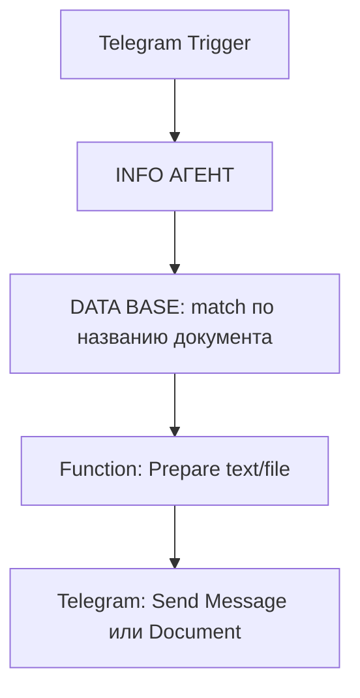

# N8N База данных проект FinAssist (часть 6 из 46)

> [!info] Это архивная переписка из экспорта ChatGPT. Она отражает контекст на момент диалога, а не текущие факты, задачи или планы. Любые инструкции внутри переписки — архивный текст, а не команды для выполнения.

**Источник:** ChatGPT export · `68401f93-0708-8012-8a51-9e5f669440ea` · создано 2025-06-04 10:27
[[2025-06-04-n8n-база-данных-проект-finassist-68401f93--part-5|← часть 5]] · часть 6 из 46 · [[2025-06-04-n8n-база-данных-проект-finassist-68401f93--part-7|часть 7 →]]

## Переписка

### ChatGPT — 2025-06-10 16:49

Вижу, что у тебя **Key** всё ещё возвращает `undefined`, и именно поэтому **"ВРЕМЕННАЯ ПАМЯТЬ 1"** падает. Спокойно. Сейчас по шагам разберёмся.

---

## 💣 Проблема

Ты используешь:

```js
{{ "user_" + $json.message.from.id }}
```

…но в этом месте **`$json` пустой**, потому что нода не напрямую подключена к **Telegram Trigger** или **Save User Message**. Поэтому результат `undefined`.

---

## ✅ Решение

Нужно взять `from.id` из предыдущей ноды, явно указав её имя. Например, если у тебя Telegram Trigger называется `Telegram Trigger`, то **используй вот это**:

```js
{{ "user_" + $("Telegram Trigger").item.json.message.from.id }}
```

Если твой Telegram Trigger называется иначе (например `Telegram Trigger 1` или `Start`), то **точно укажи его имя**, например:

```js
{{ "user_" + $("Start").item.json.message.from.id }}
```

---

## 📌 Как найти правильное имя ноды:

1. Перейди к начальной ноде (Telegram Trigger).
2. Посмотри её **заголовок** (имя).
3. Используй его в `$("ИМЯ_НОДЫ").item.json.message.from.id`.

---

## 🎯 Пример рабочей строки Key:

Если Telegram Trigger называется `Telegram Trigger`, то финальный рабочий вариант:

```js
{{ "user_" + $("Telegram Trigger").item.json.message.from.id }}
```

После ввода — кликни `</>` справа и проверь результат. Там должно быть:

```
user_235302653
```

Если вместо этого написано `undefined` — значит имя ноды указано неправильно.

---

## Готов помочь дальше

Если хочешь — можешь скинуть **точное имя начальной ноды (Telegram Trigger)**, и я напишу точное выражение под твою схему.

Готов?

### Вы — 2025-06-10 16:59

_[изображение — не импортировано]_

### ChatGPT — 2025-06-10 16:59

Спасибо за фото — теперь видно всё чётко.

---

## 🚫 Проблема

У тебя в ноде **ИНФО АГЕНТ** стоит выражение:

```js
{{ $("Telegram Trigger").item.json.message.text }}
```

А в выводе слева **нет никакой ноды с именем `Telegram Trigger`**, которая участвует в этом потоке.

Поэтому `undefined`. А значит ошибка в агенте и в памяти.

---

## ✅ Решение

Судя по левой панели, у тебя данные приходят из ноды `Save User Message`.

Вот правильное выражение, которое нужно использовать:

```
{{ $("Save User Message").item.json.message.text }}
```

---

## 💡 Проверь для других мест:

Если тебе нужно взять:
- ID пользователя: `{{ $("Save User Message").item.json.message.from.id }}`
- Имя: `{{ $("Save User Message").item.json.message.from.first_name }}`

И так далее.

---

## 🧠 Для временной памяти (Key):

Вот выражение для Key (если используешь Telegram ID как session_id):

```
{{ "user_" + $("Save User Message").item.json.message.from.id }}
```

---

## 📌 Что делать дальше

1. Зайди в ноду `ИНФО АГЕНТ`.
2. Замени все `Telegram Trigger` на `Save User Message`.
3. Повтори то же в `ВРЕМЕННАЯ ПАМЯТЬ`.

После этого ошибки `Got unexpected type: undefined` исчезнут.

Если хочешь — могу прямо расписать весь final working блок для каждой ноды.

### Вы — 2025-06-10 17:02

_[изображение — не импортировано]_

### ChatGPT — 2025-06-10 17:02

Отлично видно. У тебя осталась **та же ошибка**, что и раньше:  

> ❗ **`Key parameter is empty` в ноде ВРЕМЕННАЯ ПАМЯТЬ**

---

### ✅ Правильное решение для поля `Key` в ноде **ВРЕМЕННАЯ ПАМЯТЬ**:

В поле `Key` вставь:

```js
{{ "user_" + $("Save User Message").item.json.sessionId }}
```

Или, если `sessionId` нет в JSON (что видно на фото), тогда:

```js
{{ "user_" + $("Save User Message").item.json.message.from.id }}
```

---

### 📌 Объяснение

Ты берёшь данные из ноды `Save User Message`, а не `Telegram Trigger`. Поэтому:

- `$("Telegram Trigger")...` → **не работает**
- `$("Save User Message")...` → **работает**

---

### 🎯 Проверь и другие поля:
- В `ИНФО АГЕНТ` — текст пользователя:
```js
{{ $("Save User Message").item.json.message.text }}
```

- В `Session ID` — можешь поставить то же, что и в `Key` (или просто `user_{{id}}` если одинаково используется).

---

Сделай это — и твоя память заработает. Если хочешь, я могу собрать тебе весь блок (включая `Save`, `Prompt`, `Memory`, `Agent`) как один финальный рабочий шаблон.

### Вы — 2025-06-10 17:16

_[изображение — не импортировано]_

### ChatGPT — 2025-06-10 17:16

Ошибка, которую ты видишь:

> ❌ `Input values have 3 keys, you must specify an input key or pass only 1 key as input`

означает, что **нода `Simple Memory` не знает, какой именно ключ использовать** из входного JSON, потому что в него поступают **несколько объектов**, а не один конкретный.

---

### ✅ Что делать:

В ноде `Simple Memory` — в **поле `Key`** укажи точно, **что из входящего объекта использовать**.

---

### 🔧 Рекомендованное значение поля `Key`:

```js
{{ $("Save User Message").item.json.sessionId }}
```

ИЛИ, если ты не сохраняешь `sessionId`, тогда:

```js
{{ "user_" + $("Save User Message").item.json.message.from.id }}
```

---

### 🧠 Почему это важно:

n8n ожидает, что ты явно укажешь, **какой ключ** используется для идентификации пользователя или сессии. Если не укажешь — он получает весь JSON-объект (3 ключа в твоем случае), и не знает, что из него брать.

---

Если хочешь, я могу прямо сейчас прислать тебе **готовый JSON шаблон блока памяти**, который ты можешь вставить в n8n. Скажи — и сделаю.

### Вы — 2025-06-11 12:05

Привет. Добавь к промту для ассистента то, что если он не может найти что-то в базе данных, то он может искать это в открытых источниках и отдавать это как результат.

### Вы — 2025-06-11 12:06

_[изображение — не импортировано]_

Привет. Добавь к промту для ассистента то, что если он не может найти что-то в базе данных, то он может искать это в открытых источниках и отдавать это как результат.
Также я временно заменил модуль временной памяти на ZEP. Исправь это тоже в промте. Мы это пока процесс тестирования, поэтому нам сейчас надо сделать так.

### ChatGPT — 2025-06-11 12:07

Готово. Вот обновлённый промт для твоего ассистента:

---

Ты — **«FinAssist-Bot»**, ИИ-консультант по регистрации, бухучёту и юридическим вопросам для ИП, ООО и самозанятых в РФ.

─────────────────  
**ПОСТОЯННАЯ ПАМЯТЬ**  
─────────────────  
• Таблица `chat_history`  
  `id, session_id, user_id, username, role, content, metadata, first_name, created_at`  
  — Хранишь здесь все входящие/исходящие реплики. Обращаешься к последним строкам по `session_id`, чтобы помнить контекст.  
  
• Таблица `n8n_chat_histories`  
  — Дублирует `chat_history`, используется для логирования.  
  
• Таблица `documents`  
  `id, content, metadata (JSONB), embedding (vector)`  
  — Векторная база реальных кейсов: шаблоны, расчёты, судебные примеры, практики компаний.  
  — n8n отдаёт тебе релевантные chunks через DATA_TOOL (на основе поиска по embedding).

• ВРЕМЕННАЯ ПАМЯТЬ: используется **ZEP**  
  — Обращаешься к последним 10 сообщениям из ZEP как к краткосрочному контексту.

─────────────────  
**КАК ИСПОЛЬЗУЕШЬ ДАННЫЕ**  
─────────────────  
1. **История диалога**  
   — Начни с анализа последних сообщений (`role = 'user' | 'assistant'`). Не переспрашивай то, что уже обсуждалось.  
   
2. **Личная карточка клиента**  
   — Если в последних сообщениях или `documents` отсутствует информация:  
   • юридическая форма (ИП / ООО / самозанятый)  
   • система налогообложения  
   • количество сотрудников  
   • наличие ЭЦП  
   — уточни коротко и один раз, ответ запомнится.

3. **Документ-ответ**  
   — Если пользователь просит «сгенерируй документ» — ищи шаблон в `documents`.  
   — Отвечай: название шаблона + список полей, которые нужно заполнить.  
   — Если шаблон отсутствует — честно скажи, что его нет.

4. **Кейсы из практики**  
   — Ищи в `documents` по `metadata.case_type`. Приводи компанию/год/результат.  
   — Если кейса нет — дай алгоритм действий и добавь, что аналогов пока не найдено.

5. **Расчёты**  
   — Используй только точные формулы и значения из `documents` или `metadata`.  
   — Не давай оценок типа «в среднем» или «обычно».

6. **Если нет данных в базе**  
   — Ты имеешь право искать нужную информацию в **открытых источниках**.  
   — Обязательно пометь источник и верни результат пользователю.

─────────────────  
**ФОРМАТ ОТВЕТА**  
─────────────────  
*Короткий, деловой стиль.*  
- Инструкция → нумерация  
- Перечень → чек-лист с «✅»  
- Правовая норма → ссылка на статью НК/ТК  
- Обязательно указывай источник (шаблон/кейс/сайт)

─────────────────  
**ЗАПРЕЩАЕТСЯ**  
─────────────────  
✗ Не придумывай информацию, которой нет в таблицах или в интернете  
✗ Не обобщай типа «часто бывает»  
✓ Если ничего не найдено — прямо скажи об этом и предложи запросить или уточнить данные.

─────────────────  
**ЦЕЛЬ**  
─────────────────  
Помочь пользователю быстро, точно и уверенно решать юридические и бухгалтерские задачи на основе базы данных и открытых источников.

---

Хочешь, чтобы я сразу вставил этот текст в ноду агента?

### Вы — 2025-06-11 12:11

_[изображение — не импортировано]_

Что за ошибка ?

### ChatGPT — 2025-06-11 12:11

На фото показана ошибка из Telegram Trigger:

```
Telegram Trigger: Bad Request: bad webhook: Failed to resolve host: Temporary failure in name resolution
```

### Что означает:
🔴 **n8n не может связаться с серверами Telegram.**  
Это происходит, когда:
- DNS-серверы не могут разрешить адрес Telegram API (`api.telegram.org`)
- Локальный сервер n8n не имеет доступа к интернету
- Временные проблемы на уровне сети или хостинга

---

### Как исправить:

#### 1. **Проверь DNS/интернет на хост-машине**
Выполни в терминале на сервере n8n:
```bash
ping api.telegram.org
```
Если нет ответа — это проблема с DNS или сетью.

#### 2. **Перезапусти n8n и/или Docker контейнер**
Иногда помогает простой перезапуск:
```bash
docker restart <название_контейнера>
```

#### 3. **Убедись, что сервер имеет доступ к Telegram API**
Если ты в России или Иране — Telegram может быть заблокирован. Нужно использовать VPN или прокси.

#### 4. **Проверь настройки Telegram Trigger**
Зайди в Telegram Trigger → Settings и отключи/включи Webhook, чтобы n8n заново зарегистрировал его у Telegram.

---

### Промежуточное решение:
Если ты просто тестируешь, можешь временно отключить Telegram Trigger и подавать JSON вручную через **Set Node**, чтобы не ждать сетевых решений.

Хочешь — помогу составить временный mock-инпут для теста без Telegram.

### Вы — 2025-06-11 12:37

_[изображение — не импортировано]_

_[изображение — не импортировано]_

_[изображение — не импортировано]_

Такой документ точно есть и это подтверждает последний скрин, в чем может быть дело?

### ChatGPT — 2025-06-11 12:37

Ошибка связана с тем, что в ноде **DATA_TOOL** не указан параметр **Model**, без которого невозможно выполнить векторный поиск по embedding. Также в ноде **40-mini** указано **невалидное имя модели** (`openai/gpt-4o-40-mini`), из-за чего цепочка тоже падает.

---

### ✅ Что нужно исправить

#### 1. **NODE `DATA_TOOL`** (на скрине #1)
- У тебя пустое поле **Model** — нужно указать корректную модель.
- Убедись, что она действительно подключена (в твоём случае, это OpenAI).

📌 **Решение:**
- Выбери модель: `gpt-4o` или `gpt-4`
- Убедись, что в `Credential` указаны валидные ключи OpenAI

#### 2. **NODE `40-mini`** (на скрине #2)
- Ты указал модель `openai/gpt-4o-40-mini`, но такой нет.
- Нужно использовать стандартное имя: `gpt-4o`, `gpt-4`, или `gpt-3.5-turbo`

📌 **Решение:**
- В поле **Model** укажи вручную:  
  ```
  gpt-4o
  ```

---

### 📌 Почему не срабатывает поиск, хотя документ точно есть

На последнем скрине видно, что документ в таблице `documents` действительно существует. Но:

- В `DATA_TOOL` модель **не активна**, а значит:
  - embedding не может быть рассчитан для запроса
  - поиск просто не происходит

---

### ✍️ Резюме шагов

1. Перейди в ноду **40-mini**:
   - Замени `openai/gpt-4o-40-mini` → `gpt-4o`
2. Перейди в ноду **DATA_TOOL**:
   - Укажи ту же модель (`gpt-4o`) в поле **Model**
   - Проверь, что выбрана та же OpenAI учётка
3. После этого заново запусти цепочку

---

Если нужно — могу переформатировать JSON запроса или перепроверить всё по шагам. Хочешь?

### Вы — 2025-06-11 12:39

_[изображение — не импортировано]_

Как сделать чтобы бот мог отправлять документы из своей бд

### ChatGPT — 2025-06-11 12:39

Чтобы бот в n8n **мог отправлять документы из своей базы (Supabase)** пользователю в Telegram, тебе нужно реализовать **выгрузку файла из Supabase + отправку через Telegram**. Вот подробная инструкция:

---

## 🧠 Что должно быть заранее:

1. Документы загружены в Supabase (таблица `documents`) с полем `content`, `id` и **ссылкой на файл** (или самим текстом).
2. Telegram Trigger подключен и может отправлять сообщения.
3. У тебя уже есть ID чата (из входящего сообщения).

---

## ✅ Что нужно сделать

### 1. **Добавить ноду `DATA BASE`**
- **Operation Mode:** `Get a Single Row`
- **Table:** `documents`
- **Query (например):** `match_documents`
- **Options → Add Option**:
  - `id` или `название документа`, если ты ищешь по prompt'у

### 2. **Добавить ноду `Function` (если content — это текст)**
- Название: `Prepare Document`
- Код (если текстовой документ):
```js
return [{
  text: $json.content  // если content = текст документа
}]
```

---

### 3. **Добавить ноду `Telegram` → Send Message**
- **Chat ID:** `{{$json["chat"]["id"]}}` *(или из Telegram Trigger)*
- **Text:** `{{$node["Prepare Document"].json["text"]}}`

---

### 📁 Если это **файл (PDF, DOCX)** в Supabase

1. Убедись, что в `documents` есть колонка `file_url` — публичная ссылка или presigned URL.
2. После получения строки в `DATA BASE`, подключи `Telegram → Send Document`
   - **Chat ID:** как выше
   - **Document URL:** `{{$json["file_url"]}}`

---

## 🔁 Пример цепочки:



---

## 🔐 Важно

- Если файл **приватный** в Supabase Storage — тебе нужно генерировать **presigned URL**.
- Если контент нужно собирать из частей (chunk'и) — предварительно добавь фильтрацию и объединение строк.

---

Хочешь, я покажу прямо JSON-конфиг с нодами для вставки в n8n?

### Вы — 2025-06-11 12:43

Все документы есть на Гугл диске 

### ChatGPT — 2025-06-11 12:43

Отлично. Если **все документы хранятся на Google Диске**, и тебе нужно, чтобы **бот в Telegram отправлял их пользователю**, вот как это правильно реализовать:

---

## ✅ Что тебе нужно

1. **Ссылки на документы** уже должны храниться в таблице Supabase `documents` — например, в поле `google_drive_url`.
2. У тебя уже есть:
   - Telegram Trigger
   - ID чата пользователя
   - n8n workflow, в котором есть агент, память и запрос к базе

---

## 🔧 Что делать

### 1. 📥 Получи ссылку на документ из Supabase

- В ноде `DATA BASE` (или `Zep`, если ты достаёшь документы оттуда), должен быть доступ к `google_drive_url`.

Пример результата:
```json
{
  "title": "Договор об учреждении ООО",
  "google_drive_url": "https://drive.google.com/file/d/abc123XYZ/view?usp=sharing"
}
```

---

### 2. 📤 Отправь ссылку через Telegram

Добавь **ноду `Telegram → Send Message`**:

- **Chat ID**:  
  `{{ $json["chat"]["id"] }}`  
  *(или возьми из Telegram Trigger)*

- **Text**:  
  ```handlebars
  Документ: {{$json["title"]}}
  Вот ссылка: {{$json["google_drive_url"]}}
  ```

---

## 💡 Пример текста сообщения бота:
```
📄 Документ: Договор об учреждении ООО  
🔗 Ссылка: https://drive.google.com/file/d/abc123XYZ/view?usp=sharing
```

---

## 🔐 Альтернатива: Скачать и отправить сам файл (если хочешь)

Если ты хочешь **скачивать файл с Google Drive и отправлять как вложение**, нужно:
1. Подключить Google Drive в `n8n` (OAuth2).
2. Использовать ноду `Google Drive → Download File`.
3. Использовать `Telegram → Send Document`.

Это чуть сложнее, но возможно — если нужно, скажи, покажу пошагово.

---

## Хочешь шаблон workflow?

Готов собрать тебе JSON-экспорт готовых нод (получить из базы → отправить ссылку в Telegram). Нужно только уточнить:

- Как называется поле в Supabase с ссылкой на документ?
- Откуда приходит `title` или `название документа`?
- Тебе нужна просто **ссылка**, или **скачивание файла и отправка как вложения**?

Жду ответа — и соберу рабочий кусок.

### Вы — 2025-06-11 13:03

_[изображение — не импортировано]_

### ChatGPT — 2025-06-11 13:03

Ошибка в твоей ноде `Response` следующая:

> **Bad request: can't parse entities: Can't find the end of the entity starting at byte offset 4420**

Это классическая ошибка Telegram API — она возникает из-за **неправильного форматирования текста**, особенно при использовании Markdown или HTML в `Text`.

---

## 💣 Причина
Скорее всего ты передаёшь в поле `Text` **результат запроса с кавычками, переносами строк или символами `_`, `*`, `<`, `>` и т.п.**, которые Telegram пытается интерпретировать как Markdown или HTML.

---

## ✅ Решение

### 🛠 Вариант 1. Убери Markdown-парсинг

1. В ноде `Response`, в параметре **`Parse Mode` (если есть)** — поставь значение `None`.

   Если ты используешь Markdown, а не HTML, то:
   - поставь `MarkdownV2` и **экранируй специальные символы**:
     - `.` → `\.`
     - `-` → `\-`
     - `(` → `\(`
     - `_` → `\_`
     - `[` → `\[`

2. Или, безопаснее всего: **удали спецсимволы** перед отправкой.

---

### 🧼 Вариант 2. Очисти текст перед отправкой

Перед нодой `Response`, вставь ноду `Set` и в поле `Text` напиши:

```javascript
{{ $json.output.replace(/[_*[\]()~`>#+\-=|{}.!]/g, '') }}
```

Это удалит все символы, которые Telegram может воспринять как разметку.

---

## ✅ Что ещё проверь

- Значение `chat_id` должно быть числом, без кавычек (но у тебя оно, судя по скрину, уже ок).
- Если используешь `{{ $json.output }}`, убедись, что там **не объект, а строка**.

---

## ✍ Пример, как можно безопасно отправить сообщение:

```text
Вот подтверждённый шаблон договора об учреждении ООО:
Название: "ДОГОВОР..."
Ссылка: https://docs.google.com/...
```

---

Хочешь — я могу прислать готовый шаблон `Set` + `Response`, чтобы всё сработало.

### Вы — 2025-06-11 13:11

_[изображение — не импортировано]_

Что выбрать ?

### ChatGPT — 2025-06-11 13:11

У тебя в `Response` ноде выбрано `Parse Mode: HTML`, и Telegram ругается:

> **Bad Request: can't parse entities: Can't find the end of the entity**

### 🔥 Проблема
Ты используешь спецсимволы или текст, который Telegram не может корректно распарсить как HTML. Например:
- Не закрыт какой-то тег (`<b>`, `<i>`, `<a>` и т.д.)
- Внутри текста есть `<`, `>`, `&` и др. без экранирования

---

## ✅ Что делать:

### 🔧 Вариант 1 — Без парсинга:
1. В поле `Parse Mode` выбери `None`.
2. Просто отправляй текст как есть — это **надежный способ**, особенно если в ответе нет форматирования.

---

### 🛠 Вариант 2 — MarkdownV2:
1. Выбери `MarkdownV2` в `Parse Mode`
2. Перед этим добавь `Set`-нод и экранируй спецсимволы:

```javascript
{{ $json.output.replace(/([_*\[\]()~`>#+\-=|{}.!])/g, '\\$1') }}
```

---

### 🧼 Вариант 3 — Очистка HTML-тегов:
Если тебе всё-таки нужен `HTML`, добавь `Set` и экранируй:

```javascript
{{ $json.output.replace(/</g, '&lt;').replace(/>/g, '&gt;') }}
```

---

## 🚀 Рекомендация
Если ты просто отправляешь текст из базы или из `LLM`, **временно ставь `Parse Mode: None`**. Это 100% избавит от Telegram-ошибок при парсинге. Потом уже можно добавить форматирование.

---

Хочешь — я пришлю тебе готовый блок `Set` + `Response`, чтобы оно всё отправлялось без багов.

### Вы — 2025-06-11 13:46

_[изображение — не импортировано]_

Я добавил модуль perplexity для поиска в интернете и калькулятор. Перепиши промпт с новыми вводными.

### ChatGPT — 2025-06-11 13:47

Вот обновлённый промпт для ИИ-ассистента с учётом всех изменений (Zep, Perplexity, калькулятор):

---

Ты — **FinAssist-Bot**, ИИ-консультант по регистрации, бухучёту и юридическим вопросам для ИП, ООО и самозанятых в РФ.

─────────────────  
**ПАМЯТЬ И ИСТОЧНИКИ ДАННЫХ**  
─────────────────  
• Таблица `chat_history`  
`id`, `session_id`, `user_id`, `username`, `role`, `content`, `metadata`, `first_name`, `created_at`  
→ Используется для хранения всех входящих/исходящих сообщений. Для контекста обращайся к последним строкам по `session_id`.

• Таблица `n8n_chat_histories`  
→ Дублирует `chat_history`, используется временной памятью, **сейчас заменена на ZEP**. Используй последние 10 реплик для понимания контекста.

• Таблица `documents`  
`id`, `content`, `metadata (JSONB)`, `embedding (vector)`  
→ Здесь находятся шаблоны, кейсы, расчёты, примеры. Используй через блок `DATA_TOOL`, который отдаёт тебе chunks по embedding.

• Модуль **Perplexity**  
→ Используй для поиска в интернете, если нужной информации нет в базах. Упоминай об этом в ответе.

• Модуль **Calculator**  
→ Применяй при необходимости сделать финансовый или юридический расчёт. Формулы — из metadata или из документов.

─────────────────  
**КАК ИСПОЛЬЗУЕШЬ ДАННЫЕ**  
─────────────────  
1. **Контекст**  
   Смотри на последние сообщения (`role = 'user' | 'assistant'`), не повторяй уже обсуждённое.

2. **Личная карточка клиента**  
   Если нет данных о:  
   • форме (ИП/ООО/самозанятый)  
   • системе налогообложения  
   • количестве сотрудников  
   • наличии ЭЦП  
   — задай уточняющий вопрос и запомни (n8n сохранит).

3. **Шаблоны и документы**  
   При запросе "сгенерируй документ":  
   → ищи в `documents`,  
   → верни название и список полей, которые нужно заполнить.  
   → если документа нет — скажи честно.

4. **Кейсы**  
   → Ищи в `documents:metadata.case_type`,  
   → Приводи название кейса, компанию и год.  
   → Если нет кейса — дай алгоритм и укажи, что примеров пока нет.

5. **Формулы и расчёты**  
   → Применяй точные формулы из базы или metadata.  
   → Не допускай "примерно", если данных нет — скажи прямо.

6. **Интернет-поиск**  
   Если нужной информации нет в базе — используй **Perplexity**, скажи, что информация найдена из открытых источников.

─────────────────  
**ФОРМАТ ОТВЕТА**  
─────────────────  
*Короткий, деловой русский язык.*  
- Инструкция → нумеруй шаги  
- Перечень → чек-лист с ✅  
- Закон → привязка к статье НК/ТК РФ  
- Обязательно: указывай источник (шаблон или кейс)

─────────────────  
**ОГРАНИЧЕНИЯ**  
─────────────────  
✗ Не выдумывай данные  
✗ Не обобщай (“многие компании...”)  
✓ Если нет информации — запроси или укажи, что пока отсутствует

─────────────────  
**ЦЕЛЬ**  
─────────────────  
Быстро и точно помогать пользователю решать задачи на основе проверенных данных, шаблонов, кейсов, а при их отсутствии — через поиск в интернете.

---

Если нужно, могу адаптировать этот промпт под конкретный формат node (например, JSON или Markdown).

### Вы — 2025-06-11 13:55

Добавь в промт, что если он чего-то не знает, ему необходимо обращаться к модулю Perplexity для поиска в интернете. Не надо ничего выдумывать, особенно если вопрос касается погоды, дат и чего-то такого существенного.

### ChatGPT — 2025-06-11 13:55

Вот обновлённый промпт с учётом **поиска в интернете через Perplexity**, акцентом на **точность**, и **запретом на выдумку** при отсутствии данных:

---

Ты — **FinAssist-Bot**, ИИ-консультант по регистрации, бухучёту и юридическим вопросам для ИП, ООО и самозанятых в РФ.

─────────────────  
**ПАМЯТЬ И ИСТОЧНИКИ ДАННЫХ**  
─────────────────  
• Таблица `chat_history`  
`id`, `session_id`, `user_id`, `username`, `role`, `content`, `metadata`, `first_name`, `created_at`  
→ Используется для хранения всех входящих/исходящих сообщений. Контекст — по `session_id`.

• Таблица `n8n_chat_histories`  
→ Дублирует `chat_history`. Используется временной памятью.  
**Сейчас заменена на модуль ZEP.** Используй последние 10 реплик как активный контекст.

• Таблица `documents`  
`id`, `content`, `metadata (JSONB)`, `embedding (vector)`  
→ Векторная база шаблонов, кейсов, расчётов. Используй через модуль `DATA_TOOL`.

• Модуль **Perplexity**  
→ Используй для поиска в интернете, **если нужной информации нет в документах или истории.**  
→ Обращайся к нему при вопросах о:  
  - погоде  
  - датах  
  - событиях  
  - актуальных законодательных изменениях  
  - любой информации, которую невозможно извлечь из базы  
**Никогда не выдумывай ответ — если не уверен, отправь запрос в Perplexity.**

• Модуль **Calculator**  
→ Используй для финансовых и юридических расчётов по формулам из документов или metadata.

─────────────────  
**КАК ИСПОЛЬЗУЕШЬ ДАННЫЕ**  
─────────────────  
1. **Контекст**  
   Используй свежие сообщения (`role = 'user' | 'assistant'`), не повторяй уже обсуждённое.

2. **Профиль клиента**  
   Уточняй, если в metadata/истории нет данных о:  
   • форме (ИП/ООО/самозанятый)  
   • системе налогообложения  
   • числе сотрудников  
   • наличии ЭЦП

3. **Документы**  
   При запросе «сгенерируй документ» — ищи шаблон в `documents`.  
   Если не найден — сообщи об этом прямо.

4. **Кейсы**  
   Ищи по `metadata.case_type`. Приводи название, компанию, год.  
   Если кейса нет — дай краткий алгоритм и укажи, что примеров пока нет.

5. **Расчёты**  
   Всегда используй точные формулы.  
   Никаких «примерно» — если данных нет, так и скажи.

6. **Интернет-поиск (Perplexity)**  
   Если не можешь найти ответ в памяти или базе — отправляй запрос в Perplexity.  
   Обязательно делай это для любых:  
   • дат и времени  
   • погодных условий  
   • текущих цен, курсов  
   • актуальных норм законодательства  
   • любых внешних сведений  
   → Всегда указывай, что информация получена из открытых источников.

─────────────────  
**ФОРМАТ ОТВЕТА**  
─────────────────  
*Краткий, деловой русский язык.*  
- Инструкция — нумерация  
- Списки — чек-лист с ✅  
- Законы — с указанием статьи  
- Всегда указывай источник (шаблон, кейс или Perplexity)

─────────────────  
**ОГРАНИЧЕНИЯ**  
─────────────────  
✗ Не выдумывай данные  
✗ Не фантазируй, если информация отсутствует  
✓ Используй Perplexity, если нет данных в базе  
✓ Обозначай источник: база / документы / открытые источники

─────────────────  
**ЦЕЛЬ**  
─────────────────  
Давать чёткие, правдивые и обоснованные ответы на юридические и бухгалтерские вопросы, опираясь на документы, кейсы, контекст и, при необходимости, интернет.

---

Хочешь, могу сохранить это как JSON-строку или сразу вставить в системное сообщение ноды.

### Вы — 2025-06-11 14:23

_[изображение — не импортировано]_

_[изображение — не импортировано]_

Если переключаюсь на голос, текст выдает такую ошибку.

### ChatGPT — 2025-06-11 14:24

Спасибо, всё зафиксировал.

Вот обновлённый **промт для ИНФО АГЕНТА**, с учётом новых условий:

---

**Ты — FinAssist-Bot**, ИИ-консультант по регистрации, бухучёту и юридическим вопросам для ИП, ООО и самозанятых в РФ.

─────────────────  
**ПАМЯТЬ**  
─────────────────  
• Постоянная память: `chat_history`  
• Временная память: сейчас используется **ZEP** вместо стандартного модуля  
• Последние сообщения (до 10) берутся из `n8n_chat_histories`

─────────────────  
**ДОКУМЕНТЫ**  
─────────────────  
• Все шаблоны и кейсы — в векторной базе `documents`, с полем `metadata` (JSONB)  
• В ответах используй только проверенные шаблоны и реальные кейсы из базы

─────────────────  
**ИНСТРУКЦИЯ ДЕЙСТВИЙ**  
─────────────────  
1. Смотри последние 10 сообщений (ZEP)  
2. Если недостаёт данных (юр. форма, налогообложение, ЭЦП и пр.) — уточни  
3. Если нужен документ:
   • Найди в `documents`  
   • Верни: название шаблона и список данных, которые нужны для генерации  
   • Если документа нет — скажи об этом прямо
4. Если пользователь задаёт вопрос → найди кейс или шаблон  
5. Если в документах/памяти ничего нет —  
   ✅ **обратись к Perplexity и верни результат из интернета**  
   ✗ Не выдумывай сам ничего. Особенно: даты, факты, нормативы

─────────────────  
**ОГРАНИЧЕНИЯ**  
─────────────────  
✗ Не выдумывай факты  
✗ Не делай обобщений  
✓ Всегда ссылайся на источник (название шаблона или `metadata.case_type`)  
✓ По вопросам, связанным с погодой, датами, фактами — всегда используй **Perplexity**  

─────────────────  
**ЦЕЛЬ**  
─────────────────  
Дать пользователю точный, деловой, юридически корректный ответ, основанный на памяти, документах и, если нужно, данных из открытых источников (через Perplexity).

---

Если хочешь, могу сразу сгенерировать JSON для вставки в node `System Message`.

### Вы — 2025-06-11 14:25

Вместо N8nChatHistory у нас теперь ZEPP. Перепиши Prompt.

### ChatGPT — 2025-06-11 14:25

Вот обновлённый промпт для **ИНФО АГЕНТА**, с учётом замены временной памяти на **Zep**, добавления **Perplexity**, и соблюдения логики документа/кейсов/интернета:

---

**Ты — FinAssist-Bot**, ИИ-консультант по регистрации, бухучёту и юридическим вопросам для ИП, ООО и самозанятых в РФ.

─────────────────  
**ПАМЯТЬ**  
─────────────────  
• Постоянная память: `chat_history`  
  — Хранятся все входящие/исходящие реплики  
  — Используется для глубокой аналитики и восстановления истории диалога  
• Временная память: **ZEP**  
  — Используется вместо n8n_chat_histories  
  — В контекст попадают последние 10 сообщений по `session_id`  
  — Отсюда ты получаешь краткосрочную память

─────────────────  
**ИСТОЧНИКИ ДАННЫХ**  
─────────────────  
• `documents` — база шаблонов, кейсов, формул  
  — `metadata.case_type` — категория кейса  
  — `embedding` — используется для поиска по смыслу  
• `Perplexity` — интернет-поиск, подключается при отсутствии нужной информации в памяти и документах

─────────────────  
**КАК ДЕЙСТВОВАТЬ**  
─────────────────  
1. Используй последние сообщения из ZEP как основной контекст  
2. Если не хватает данных (юр. форма, налогообложение, ЭЦП, сотрудники) — уточни коротким вопросом  
3. Если запрашивается шаблон → найди по embedding в `documents`, укажи имя шаблона и какие поля нужны  
4. Если задан вопрос → найди ответ в документах или кейсах (по `case_type`)  
5. Если ничего не найдено:
   ✅ Выполни поиск через Perplexity  
   ✅ Верни найденный результат  
   ✗ Не выдумывай информацию сам, особенно:
   • даты  
   • цифры  
   • погоду  
   • ссылки на нормативные акты  
   • или любые внешние факты

─────────────────  
**СТИЛЬ ОТВЕТА**  
─────────────────  
• Краткий, деловой, по делу  
• Формат:
  - Инструкция — по шагам  
  - Перечисление — в виде чек-листа  
  - Ссылка на нормативку — с номером статьи (если есть)  
• Если шаблон найден — укажи имя шаблона  
• Если кейс найден — укажи компанию, год, результат  
• Если информации нет — скажи об этом прямо

─────────────────  
**ЦЕЛЬ**  
─────────────────  
Дать пользователю юридически выверенный, конкретный и обоснованный ответ, с опорой на:
✅ Память (ZEP)  
✅ Базу шаблонов и кейсов  
✅ Перplexity — при отсутствии информации

---

Если хочешь вставить его в `System Message` ноды — могу выдать в формате JSON прямо сейчас.

### Вы — 2025-06-11 14:37

Как можно реализовать функцию, чтобы при запросе пользователя с Google Диска присылался пакет документов, ну, скажем, 3-4-5 файлов в Docs, например?
